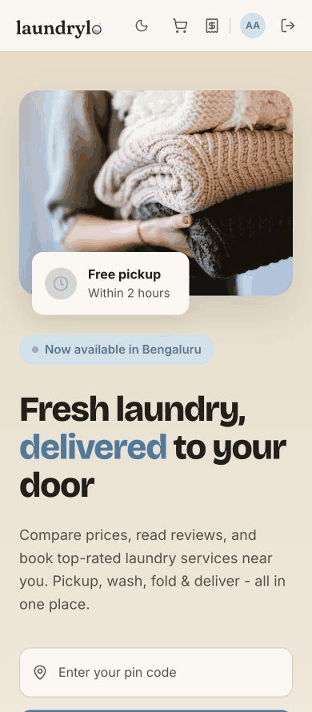
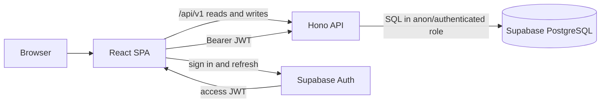

# laundrylo 🧺

laundrylo is a full-stack laundry marketplace demo for discovering nearby
partners, comparing per-item services, scheduling pickup and delivery, and
tracking an order. The repository contains a React client, a Hono API, and a
PostgreSQL schema managed with Supabase migrations.

**Live → [laundrylo.com](https://laundrylo.com)**

## Product tour

The tour follows discovery, a partner catalogue, cart, pickup scheduling,
bookings and order tracking on both desktop and mobile.

### Desktop

[](https://laundrylo.com)

### Mobile

<p align="center">
  <a href="https://laundrylo.com">
    
  </a>
</p>

## What is implemented

- Responsive marketplace, partner listing, filters and sorting
- Per-partner catalogues and a one-partner cart
- Pickup and delivery slot selection
- Persistent profiles and saved addresses, server-backed carts and order tracking
- Plus membership selection with server-computed pricing and discounts
- Supabase email/password authentication, email confirmation, password recovery,
  Google OAuth with PKCE, session restoration and current-session sign-out
- Installable PWA shell with offline caching for safe public reads
- Hono API for partners, catalogues, slots, profiles, addresses, carts, orders and membership
- PostgreSQL migrations, seed data, Row Level Security and API integration tests
- CI gates for frontend and backend types, lint, tests and production builds

Marketplace data, account resources, cart totals and orders come from PostgreSQL
through the API. Authentication runs through Supabase Auth, and signed-in API
calls carry the current access token for server verification. Order placement
reprices the cart, reserves both slots, snapshots the address and catalogue,
activates a selected membership and clears the cart in one transaction.

## Architecture



The browser uses same-origin `/api` requests. In development Webpack proxies
them to port `8787`; in production the host or edge layer must forward `/api/*`
to the API without rewriting the path. The API verifies Supabase access tokens
when present and executes database work in the matching Postgres RLS role.

See [docs/architecture.md](docs/architecture.md) for the detailed design and
[docs/api-contract.md](docs/api-contract.md) for the implemented route contract.

## Stack

| Layer          | Technology                                                           |
| -------------- | -------------------------------------------------------------------- |
| Frontend       | React 18, TypeScript 5.6, React Router 7, Webpack 5                  |
| UI             | SCSS Modules, Lucide icons, GSAP + Lenis on `/journey`               |
| Client state   | React context, guest-cart `localStorage`, server cart after sign-in  |
| PWA            | Workbox service worker and web app manifest                          |
| API            | Node.js 22, Hono 4, TypeScript, Zod, `pg`, `jose`                    |
| Data           | PostgreSQL 17, Supabase migrations and seed data                     |
| Authentication | Supabase Auth JS, email/password, Google OAuth and JWT verification  |
| Quality        | ESLint, Stylelint, Prettier, Vitest, Testing Library, GitHub Actions |
| Hosting        | Netlify frontend behind Cloudflare, Node API, hosted Supabase        |

## Repository layout

```text
api/                  Hono API and integration tests
docs/                 product, architecture, contract and schema documentation
supabase/migrations/  versioned PostgreSQL schema
supabase/seed.sql     Bengaluru demo data
ui/                   React SPA and frontend tests
```

## Local setup

### Prerequisites

- Node.js `22.13.0` or newer in the Node 22 line
- npm
- Docker Desktop or another Docker-compatible container runtime

### 1. Database

From the repository root:

```bash
npm ci
npm run db:start
npm run db:reset
```

This starts the local Supabase stack, applies every migration and loads the demo
data. `npm run db:status` prints the local service URLs and keys. Supabase Studio
is available at [http://localhost:54323](http://localhost:54323), and local
confirmation and recovery emails appear in Mailpit at
[http://localhost:54324](http://localhost:54324).

If Docker is unavailable, use the plain-Postgres fallback in
[supabase/local/README.md](supabase/local/README.md).

### 2. Backend

In a second terminal:

```bash
cd api
npm ci
cp .env.example .env
npm run dev
```

The checked-in example is safe and points at the local Supabase ports. The API
runs at [http://localhost:8787](http://localhost:8787); its database-aware health
check is [http://localhost:8787/health](http://localhost:8787/health).

### 3. Frontend

In a third terminal:

```bash
cd ui
npm ci
cp .env.example .env
npm run dev
```

Paste the local project URL and publishable key from `npm run db:status` into
`ui/.env`, then open [http://localhost:3000](http://localhost:3000). The
development server proxies `/api` to the backend, so it does not need an API
base URL or separate CORS configuration.

Email/password auth works entirely against the local stack. To test Google
locally, copy the repository-root `.env.example` to `.env`, add a Google Web
OAuth client ID and secret, and set `auth.external.google.enabled = true` in
`supabase/config.toml`. Register `http://localhost:3000` as an authorised
JavaScript origin and `http://127.0.0.1:54321/auth/v1/callback` as an authorised
redirect URI, then restart the Supabase stack.

## Checks

Run each package independently:

```bash
# Frontend
npm --prefix ui run typecheck
npm --prefix ui run lint
npm --prefix ui run lint:styles
npm --prefix ui run format:check
npm --prefix ui test
npm --prefix ui run build

# Backend (database must be running and seeded)
npm --prefix api run typecheck
npm --prefix api run lint
npm --prefix api run format:check
npm --prefix api test
npm --prefix api run build
```

`npm --prefix ui run check` and `npm --prefix api run check` run the respective
complete gate. GitHub Actions runs the same gates in separate frontend and
backend jobs; the backend job creates a clean PostgreSQL 17 database first.

## Deployment

### Frontend

Build from `ui/` with `npm ci && npm run build` and publish `ui/dist`. The build
requires `SUPABASE_URL` and `SUPABASE_PUBLISHABLE_KEY`; both are browser-safe
project settings. It includes the SPA `_redirects` rule and a `_headers` rule
that forces `service-worker.js` revalidation. Keep generated source maps out of
the public directory.

### Backend and PostgreSQL

1. Create a hosted Supabase project, link the repository and apply the reviewed
   migrations. Do not load `supabase/seed.sql` into production; it is demo data.

   ```bash
   npx supabase login
   npx supabase link --project-ref <project-ref>
   npx supabase db push --dry-run
   npx supabase db push
   ```

2. Create a dedicated API database login that can assume only `anon` and
   `authenticated`; do not run the API as a schema owner.
3. Build the API from `api/` with `npm ci && npm run build`, then run `npm start`
   with the variables documented in [`api/.env.example`](api/.env.example).
4. Point `DATABASE_URL` at hosted PostgreSQL with TLS required, set
   `SUPABASE_URL`, leave `SUPABASE_JWT_SECRET` unset so hosted JWKS is used, and
   set `NODE_ENV=production`.
5. Route public `/api/*` traffic to the API and monitor `/health`. Configure
   `CORS_ORIGINS` if the API is also exposed on a different browser origin.

For a persistent Node service, use the direct Supabase connection when the host
supports IPv6, or the session pooler when it needs IPv4. Store the connection
string and database password only in the API host's secret manager.

### Authentication

1. Set the Supabase Auth Site URL to `https://laundrylo.com`. Add
   `https://laundrylo.com/auth/callback` and
   `https://laundrylo.com/update-password` to the redirect allow list. Keep
   localhost redirects on the local project, not the production project.
2. Enable email/password authentication, email confirmation and secure password
   changes. Configure production SMTP before relying on verification or
   password-reset email delivery.
3. For Google sign-in, create a Web OAuth client and add
   `https://laundrylo.com` as an authorised JavaScript origin. Add
   `https://<project-ref>.supabase.co/auth/v1/callback` as an authorised redirect
   URI, then store the client ID and secret in the Supabase Google provider
   settings and enable the provider.
4. Expose only the Supabase project URL and publishable key to the browser. Keep
   the database password, provider secret and any service-role key server-side.
5. Verify email sign-up, password reset, Google sign-in, token refresh and
   sign-out on the production origin. Then call one API route with the access
   token and confirm the API accepts its issuer and audience.

### Production routing

The API proxy must run before the SPA fallback. A Netlify configuration can use
this ordering (replace the API hostname):

```text
/api/*  https://api.example.com/api/:splat  200
/*      /index.html                          200
```

The `/api` prefix is deliberately preserved because the server routes live
under `/api/v1`.

## Documentation

Start with the [documentation index](docs/README.md). The PRD defines the
product, the architecture document describes the implemented system and gaps,
the API contract documents the live routes, and the schema documents PostgreSQL
and RLS.

The experimental wash-cycle journey remains available at `/journey` by direct
URL. It is intentionally not linked from the product navigation; its design and
motion decisions are preserved in [docs/journey.md](docs/journey.md).
