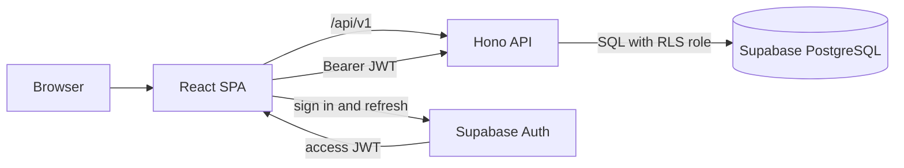

# laundrylo - architecture

Status: **living document**. Describes the deployed full-stack topology,
including authenticated customer writes. Pairs with
[api-contract.md](./api-contract.md) and [schema.md](./schema.md).

---

## 1. Shape

Production origin: **https://laundrylo.com**



The frontend is a static bundle - no server rendering. Dynamic marketplace data
comes through the API. Identity is delegated entirely to Supabase Auth; the API
verifies sessions but never receives or stores a password.

## 2. Frontend

### Stack

React 18 + TypeScript, bundled with Webpack 5. Routing is react-router-dom v7,
authentication uses `@supabase/supabase-js`, styling is SCSS Modules, and icons
are lucide-react. No state library - React context covers what we need.

The journey at `/journey` adds GSAP with ScrollTrigger and Lenis, and a
self-hosted Fraunces variable font. All three are scoped to that one route: the
route is lazy, the motion libraries load after first paint into an async chunk,
and the font is declared but never preloaded, so nothing else in the app pays for
any of it.

### Directory layout

```
ui/src/
  common-ui/     reusable presentational components, one folder each
  pages/         route-level screens, grouped by feature
  hooks/         all logic; components stay JSX-only
  context/       Auth, Cart, Theme providers
  config/        copy, routes, tokens, tunables - no literals in components
  models/        shared TypeScript types, including the API's wire shapes
  motion/        the journey's scroll spine, loaded on demand
  services/      the only place that talks to the API or Supabase Auth
  data/          test fixtures and static product vocabulary
  utils/         pure helpers
  styles/        shared SCSS mixins and tokens
  __tests__/     integration tests
```

Naming: components PascalCase, directories kebab-case, styles
`<name>.module.scss` with camelCase class exports, helpers `xUtils.ts`, config
`xConfig.ts`, and API clients `xServices.ts`.

### The rules that shape the code

- **TSX files contain JSX only.** Every non-trivial decision lives in a hook -
  `useCheckoutForm`, `usePartnerListing`, `usePinCodeSearch`. This is why the
  pages are small and the hooks are where the behaviour is.
- **Only `services/` calls `fetch`.** Hooks call a service, components call a
  hook. `services/apiClient.ts` is the one place a response becomes either data
  or an `ApiError`, so no component ever sees a status code.
- **Every request has three states, and `AsyncBoundary` renders all three.**
  Loading, failed with a way to retry, and loaded. A screen cannot quietly skip
  one, and data is cleared while reloading rather than held: showing the previous
  partners under new filters says something untrue until the network answers.
- **No hardcoded copy, colours, fonts or data in components.** Copy and tunables
  live in `config/`, design tokens in CSS custom properties.
- **Theming is runtime.** Light and dark are CSS custom property sets; Sass
  variables alias `var(--*)` so a single toggle re-themes everything without a
  rebuild. The journey is the one exception: it pins itself to the paper theme
  and hides the toggle, because a dark wash cycle is not a variant of the design,
  it is a different design.

### State

| Concern                    | Where it lives | Persistence                                              |
| -------------------------- | -------------- | -------------------------------------------------------- |
| Guest cart                 | `CartContext`  | Versioned `localStorage`, merged after authentication    |
| Signed-in cart and totals  | API/PostgreSQL | One active cart per account                              |
| Profile, addresses, orders | API/PostgreSQL | Protected by user-scoped RLS                             |
| Auth                       | Supabase Auth  | Short-lived access token plus rotated refresh session    |
| Theme                      | `ThemeContext` | `localStorage`                                           |
| Partners, slots            | API/PostgreSQL | Partner reads cached 5 min by the SW; slots never cached |

`AuthContext` subscribes to Supabase's session lifecycle. It restores the
session on startup, follows token refreshes, keeps the current access token in
memory for `apiClient`, and clears it on sign-out. The Supabase client owns
refresh-session persistence; the application does not keep a second identity or
session record in `localStorage`. Once the session is restored, `/me` and
`/addresses` hydrate the application profile. Credentials and email ownership
remain Supabase concerns; app preferences and delivery details remain database
resources protected by RLS.

Email links and Google use PKCE: the redirect carries a short-lived, single-use
authorization code rather than access or refresh tokens. Supabase exchanges the
code during client initialization and removes it from the URL. The header's
ordinary sign-out clears only the current browser session; other devices remain
signed in unless an explicit global sign-out capability is added.

The cart carries the partner's id **and name**, and each line carries the
category it was added from. Both are copied at add time because the catalogue
that priced them is per partner and lives on the server: without them the cart
would have to fetch before it could name where the order is going, or say which
of three "Shirt / T-shirt" lines is which.

The cart is versioned (`STORAGE_VERSION`) so a shape change discards stale data
rather than letting it reach components, and all reads are wrapped in try/catch
because private browsing can reject storage.

After sign-in, `CartContext` merges the versioned guest cart into `/cart` and
becomes a thin cache over server-computed totals. A partner conflict is resolved
only after the customer confirms replacement. The guest wins that conflict;
matching carts take the larger quantity for each line.

### Routing and loading

The homepage ships in the initial bundle; every other route, the journey
included, is `React.lazy` behind a Suspense boundary in `Layout`. Webpack `splitChunks` separates vendor
code. Protected routes (`profile`, `bookings`) sit behind a `ProtectedRoute`
wrapper that waits for session restoration before redirecting. Sign-in and
sign-up use the inverse guest-only guard. `/auth/callback` completes email and
Google sign-in and permits only same-origin return paths; `/update-password`
accepts only a Supabase password-recovery session.

`Layout` renders the shared header and footer for every route except
`/journey`. The journey carries its own minimal header and its own footer, which
is the last phase of the cycle rather than a component bolted underneath it. The
route is intentionally absent from the product navigation and remains available
only by direct URL.

Because it is an SPA on static hosting, deep links need rewrite rules -
`_redirects` sends everything to `index.html`, without which `/cart` 404s on
refresh.

### The journey scroll spine

The journey is six sections, each exactly one viewport, driven by scroll
position. Three things make that affordable:

- **Only the hero is eager.** The hero and the spine ship in the initial bundle,
  and a `motion` cache group keeps GSAP and Lenis in an async chunk so the entry
  never carries them.
  Sections 2 to 6 are dynamic imports, prefetched one section ahead by an
  IntersectionObserver. Each unloaded section still reserves 100vh, so the
  scrollbar never lies and nothing jumps as chunks arrive; `ScrollTrigger.refresh()`
  runs after each one mounts.
- **Motion is compositor only.** transform, opacity and clip-path, with no
  layout-affecting animation and no CSS filter blur while anything moves. Blur is
  faked with skew, stretch and opacity ghosts, because a real blur on a moving
  layer costs a repaint per frame.
- **Rest states are static HTML.** Every section renders its complete final
  content before any JavaScript runs, which is what makes
  `prefers-reduced-motion` a matter of not starting the animations rather than a
  separate code path.

Every phase is pinned and scrubbed. `motion/pinScene.ts` is the one place that
creates a hold: arriving at a section pins it, and the scrolling that follows
runs its choreography. That is what makes a phase cost what it is worth, and it
is why a section cannot be skimmed. `pinScene` also reports the trigger's state
once on creation, which matters because the scenes are lazy: ScrollTrigger fires
`onToggle` on a crossing, and a crossing that happened before the trigger existed
never fires, so a scene that waits for it sits frozen until the visitor scrolls
past and comes back.

The same file carries the two other windows a phase can ask for. `whileVisible`
is the widest: a section is on screen for a viewport before its hold begins and
one after it releases, and that is the window ambient effects (droplets, bubbles,
the drum's own rotation) run in, so a physics loop never ticks behind five other
sections. `onceInView` is the narrowest and fires once, a quarter of a viewport
into the section, for anything that should greet the visitor: the spin's figures
start there rather than on the hold, because by the time a section is held its
contents have been readable for most of a viewport and anything that waits looks
like a reaction to the lock.

Some ambient motion is narrower than `whileVisible` rather than wider. The dry's
breeze runs only while its section is held, because the breeze is the phase
playing rather than scenery around it; off the hold the clock it is read from
stops and the pendulums damp onto their last angle, so the line stills instead of
freezing. Deterministic choreography is scrubbed against the hold and reverses
exactly. [journey.md](./journey.md) is the reference for all of it.

Anything that writes an SVG transform every frame writes it to the attribute
rather than through GSAP. GSAP resolves `svgOrigin` against the scene's own
coordinate system, so a scene-relative origin turns an element about the corner
of the drawing, and the error grows with distance from it.

Lenis owns the scroll on `/journey` and is torn down on navigation, so app
routes keep native scrolling and `useScrollToTop` behaves. There is no snapping:
with every phase pinned the scroll is nearly always inside a hold, and a snap to
the nearest section start would pull the page back through an animation in
progress. A per-event step cap and a lookahead cap in `motion/spine.ts` keep a
hard flick from outrunning the holds; the lookahead is a speed limit in disguise,
because Lenis closes the gap between page and target exponentially and the widest
that gap may be therefore sets the fastest the page can move.

A hold is what a phase costs in scrolling, and because a phase is scrubbed
against its own hold, a longer hold is the same choreography played more slowly.
That is the only speed control the page has, and the only honest one.

Long moves happen behind a fade. `motion/softCut.ts` fades the page out, moves it
while nobody can see it, and fades it back: scrolled smoothly, a dozen screens is
every phase scrubbing backwards at a speed nobody can read. It is what "back to
the start" uses, what an anchor more than two viewports away uses, and what the
tour uses to reach the top before it plays. `common-ui/soft-link` preserves the
same route-transition treatment for a future mounted entry point, but no current
navigation renders it.

`useCycleTour` plays the cycle for a visitor who would rather watch it: a
constant scroll from the top, paced in viewports a second because the holds are
measured in viewports, which makes scroll speed playback speed. Any wheel, swipe
or scrolling key hands the page back at the position it had reached.

### Static assets and social previews

Brand assets (`laundrylo-logo.svg`, `laundrylo-mark.svg`,
`laundrylo-appicon-v2.svg`, `laundrylo-washer.svg`) live in `ui/src/assets/` and
are the reference artwork: the built machine, header wordmark, progress dial and
loader must match them rather than being redrawn. They are imported through
webpack's asset pipeline, and inlined into the DOM where their parts need to
animate.

`public/` is copied verbatim into the build by a small webpack plugin, with
filenames left unhashed. That matters for `og-image.png`: the page head points at
`https://laundrylo.com/og-image.png` as an absolute URL, because crawlers do not
run JavaScript and resolve nothing relative, so a content hash would break every
social preview on each deploy.

The preview card is generated from `ui/tools/og-image.html` - a standalone page
using the brand tokens and wordmark, rendered headless at exactly 1200x630. The
source is kept in the repo so the card can be regenerated when the brand or
strapline changes, rather than being an orphaned binary.

### Offline and installability

`public/manifest.json` makes the app installable: standalone display, the cream
brand colour for the splash and title bar, and shortcuts to Bookings and Cart.
Installation is left to the browser's own affordance rather than a custom
prompt, so there is no dismissal state to keep and nothing to nag with.

Icons ship in two sets. The `any` icons are the app tile as drawn. The
`maskable` icons are a separate render, because Android crops maskable icons to
a circle: the drum sits inside the 80% safe zone with cream bleeding to every
edge. Reusing the full-bleed tile for both would clip the artwork on most
Android launchers.

The service worker is built by Workbox's `InjectManifest` from
`ui/src/service-worker/sw.ts`, so the precache list is generated from the assets
webpack actually emitted rather than hand-maintained. Source maps, `_redirects`,
`_headers` and the social preview are excluded: none belongs in a client cache.
Runtime rules cover what precaching cannot - `StaleWhileRevalidate` for the
allowlisted public partner reads, `NetworkOnly` for slots, `CacheFirst` for
images and font files, and a navigation route that resolves every client-side
path to the shell.

The shell and previously visited partner catalogues work offline; live slot
availability deliberately does not. A signed-out cart persists to
`localStorage`; authenticated resources are never put in Cache Storage.

A new worker is never allowed to take over on its own. It parks in `waiting`,
the app offers a reload, and only then does it receive `SKIP_WAITING` and reload
on `controllerchange`. Silently swapping the bundle would reload someone out of
a half-filled checkout form.

No service worker is registered in development. A stale cache while editing
costs more than offline support is worth.

Two consequences worth remembering. The plugin that copies `public/` recurses,
because `public/icons/` would otherwise be dropped from every build. And
`service-worker.js` must not be served with a long cache lifetime, or a deploy
takes as long to reach users as that header allows. The build emits Netlify's
`_headers` rule with `Cache-Control: no-cache, max-age=0, must-revalidate`; an
equivalent rule is required if the static host changes.

### Error handling

A class-component error boundary wraps the app and renders a branded fallback
rather than a blank page. It uses the same design tokens as the rest of the app,
so a crash still looks like laundrylo.

### Testing

Vitest + Testing Library, integration-first: tests drive real user journeys
(add to cart -> checkout -> confirm) rather than asserting on internals.
`npm run check` runs typecheck, eslint, stylelint, prettier, tests **and the
production build** - the build is in there because a css-loader misconfiguration
once shipped a blank page that every other check passed.

Automated checks do not catch visual or scroll regressions. Browser verification
via the Chrome DevTools Protocol is used for anything positional.

That gap is widest on the journey: happy-dom has no layout, so ScrollTrigger and
the physics never run under test. `Journey.test.tsx` asserts the static rest
state, the reduced-motion render and the links, which is exactly the content
parity the design requires anyway. Motion is verified in a browser.

`App.test.tsx` additionally asserts that the homepage and the journey quote the
same figures, name the same steps and list the same services. The two pages tell
one story twice, and them drifting apart would not look like a failure: it would
look like a site that simply says two different things. See
[journey.md](./journey.md) section 20.

## 3. Backend

The deployed Hono service in [`api/`](../api/) serves partners, catalogues,
slots, profiles, addresses, carts, orders and membership from PostgreSQL.

### Why Supabase

Postgres and auth in one managed platform. Auth is the deciding
factor: it gives short-lived access JWTs, automatic refresh rotation, OAuth
providers, and revocation at the refresh-token layer, none of which we want to
build. See [api-contract.md](./api-contract.md) decision 5.

### Why a Node service in front of it

A plain HTTP service in `api/` rather than Supabase Edge Functions or PostgREST
straight from the client. The contract's shapes - one error envelope, money
objects, cursor pagination, server-computed totals, idempotent order placement -
are the service's job. Pushing them into Postgres functions and the client is
exactly how they drift apart.

TypeScript on Hono, `pg` for Postgres, `jose` for token verification, Zod for
query validation.

```
api/src/
  app.ts       middleware, routing, the error envelope
  config.ts    every environment value, resolved at boot
  models.ts    the wire shapes, mirroring ui/src/models
  auth/        Supabase token verification
  db/          connection pool and the RLS session wrapper
  http/        errors, money, cursors, validation, serializers
  queries/     SQL, one function per query
  routes/      one file per resource
```

The rule that shapes it: **a storage row never reaches a response.** Public
marketplace serializers live in `http/serializers.ts`; customer-resource
mapping lives beside its transactional reads in `customerQueries.ts`.

### Database

Built by `supabase/migrations/`, filled by `supabase/seed.sql`, documented in
[schema.md](./schema.md). Six migrations: tables and enums, then RLS, then the
derived pieces the listing needs - `pincode_centroids` and a haversine function
for distance, the `partner_details` view deriving `services` and `startingPrice`
from the catalogue, and `generate_slots`, which turns a partner's opening hours
into bookable rows - followed by the constraints and grants that harden slot
generation, followed by the catalogue vocabulary and opaque-id hardening, and
finally the atomic customer write path and slot-rollover schedule.

Two things are derived rather than stored, and that is the point of them:
`Partner.services` is the distinct set of `catalog_categories.service`, and
`startingPrice` is the cheapest active item. Neither can advertise something the
partner does not actually sell.

### Request path

1. Supabase Auth issues and refreshes the browser session.
2. When a session exists, the client attaches
   `Authorization: Bearer <supabase access token>`. Public read routes remain
   available to anonymous callers.
3. API verifies the token issuer, audience, authenticated role, user identifier
   and signature against Supabase's JWKS, or against a shared HS256 secret when
   running the local stack. A malformed or expired token is a `401`, never a
   silent downgrade to anonymous: the user believes they are signed in, and
   quietly showing them a signed-out view is the harder failure to diagnose.
4. `auth.uid()` identifies the caller; Row Level Security enforces ownership at
   the database rather than trusting application code.

### Row Level Security is not bypassed

The local development connection is privileged enough to assume the API roles;
the production connection is a dedicated login that can assume only `anon` and
`authenticated`. `db/pool.ts` exposes `asCaller`, which opens a transaction, sets
`request.jwt.claims`, and assumes the `anon` or `authenticated` role before
running the query. A handler that forgets an ownership check returns nothing
rather than someone else's rows, and because `set local` is scoped to the
transaction, a pooled connection cannot leak one request's caller into the next.

Order placement uses the narrow `place_order` security-definer function. It
derives the caller from `auth.uid()`, reprices the live cart, locks and reserves
both slots, snapshots the address and catalogue lines, records the first event,
activates Plus when selected and clears the cart in one transaction. Direct
order inserts remain unavailable to API roles.

### What the server owns

The server owns the following business invariants; the browser renders their
results rather than reimplementing them.

- **Money.** Subtotals, tax, delivery fees and membership discounts are computed
  server-side and returned. The client renders what it is given.
- **Availability.** Slot capacity, partner hours and holidays. Booking increments
  the slot count inside the order transaction, so `409 SLOT_UNAVAILABLE` is
  truthful under concurrency. A slot that has already started is reported
  unavailable rather than hidden, so the client has one rule to render.
- **`isOpen`.** Manual toggle plus optional auto-scheduling from opening hours,
  resolved by `is_partner_open` at query time.
- **Order history.** Item names, prices and addresses are snapshotted onto the
  order at placement so later edits never rewrite the past.

### What the client owns

- All presentation: labels, formatting, locale, `done/current/pending` states in
  the timeline. The API sends events that happened; the client decides how they
  read. That way copy changes never need a backend deploy.

### Idempotency

The `POST /orders` contract carries a client-generated `Idempotency-Key`, unique per user in
the database. A replay returns the original order, so a double-tapped Place Order
cannot create two orders.

## 4. Backend rollout

The migration from local feature fixtures to the deployed backend proceeds per
resource rather than as one large transport rewrite:

1. **Agree the contract.** Done - see [api-contract.md](./api-contract.md).
2. **Build the schema and the read path.** Done - `supabase/` and `api/` serve
   partners, catalogue and slots against that contract.
3. **Introduce `services/*Services.ts`** as the only place that talks to the
   network. Done - the listing, the partner page and the checkout schedule all
   read from the API, and `data/partners.ts` and `data/menu.ts` are gone.
4. **Build the write path.** Done: `/me`, `/addresses`, `/cart` with
   server-computed totals, idempotent `POST /orders`, order history and
   `/membership` are implemented and consumed.
5. **Keep only purposeful local data.** `data/orders.ts` and `data/user.ts` are
   browser-test fixtures. Homepage service cards are product vocabulary and
   presentation, not records that need a backend endpoint.

## 5. Deployment

The production system has three deployable parts:

1. **Frontend:** build `ui/` and publish `ui/dist` to Netlify. The generated
   `_redirects` contains the SPA fallback; the edge configuration must forward
   `/api/*` to the Node service before that fallback runs. The build receives
   only `SUPABASE_URL` and `SUPABASE_PUBLISHABLE_KEY`.
2. **API:** run the compiled `api/dist/index.js` as a long-lived Node 22 service.
   Set `DATABASE_URL`, `SUPABASE_URL`, `NODE_ENV=production`, the platform's
   `PORT`, and the permitted `CORS_ORIGINS`. Hosted Supabase uses JWKS, so
   `SUPABASE_JWT_SECRET` stays unset.
3. **Supabase:** apply migrations before the API version that requires them,
   set the production site and callback/recovery redirects, configure SMTP,
   enable email confirmation and Google, and keep provider secrets in Supabase
   rather than the repository.

The API database login is not the schema owner. It is granted only the ability
to assume `anon` and `authenticated`, so every request must pass through
`asCaller`. PostgreSQL connections require TLS in production. `/health` is the
readiness probe and returns `503` when the database cannot be reached.

## 6. Known gaps

- No analytics, no error reporting service.
- No partner admin panel, so `is_open`, hours and catalogs have no editor.
- Images are Unsplash URLs rather than owned assets.
- Cash on pickup only; no payment integration.
- Serviceability still needs the operational choice between exact-pincode and
  distance-radius coverage before checkout can enforce it.
- The API has a per-instance order-write limiter; production should also keep a
  shared edge limiter across instances.
